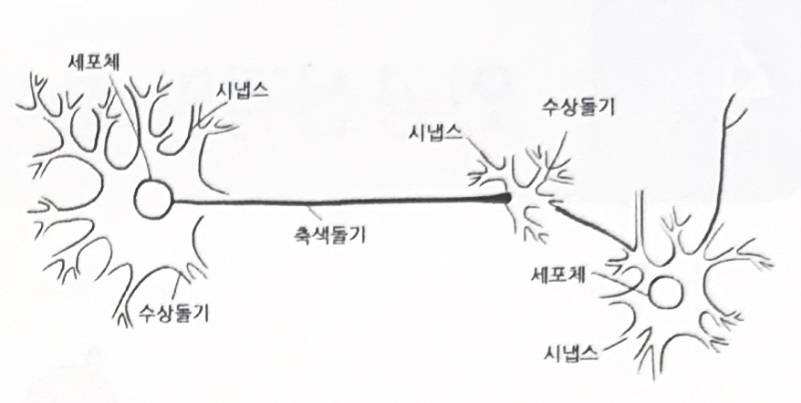
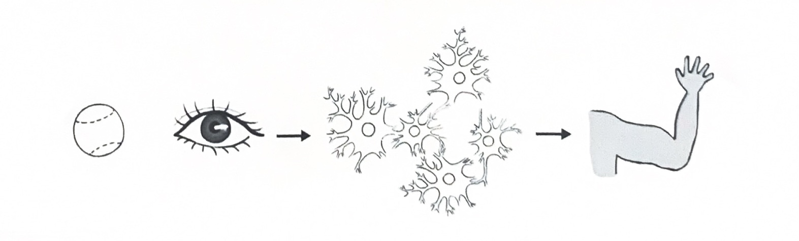
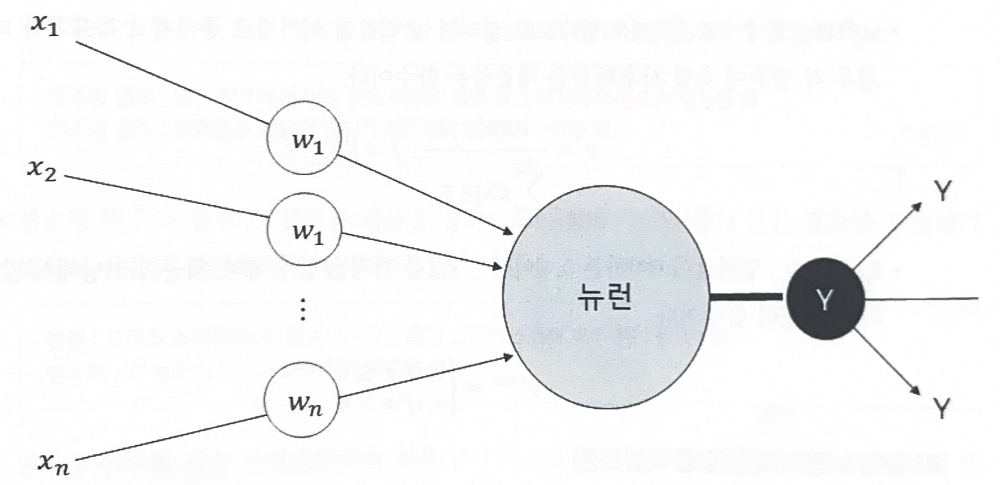
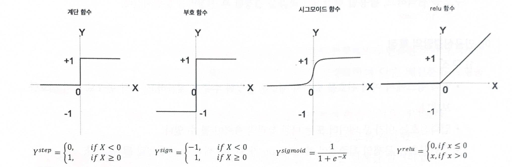
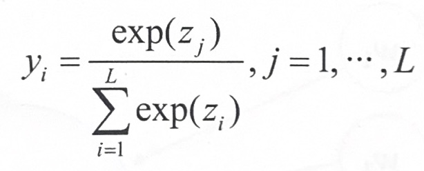
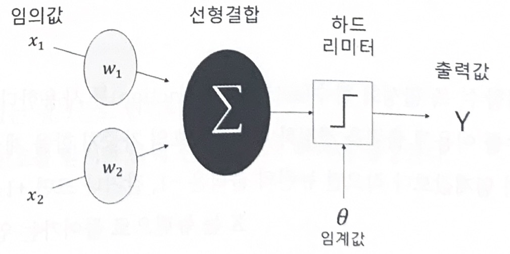
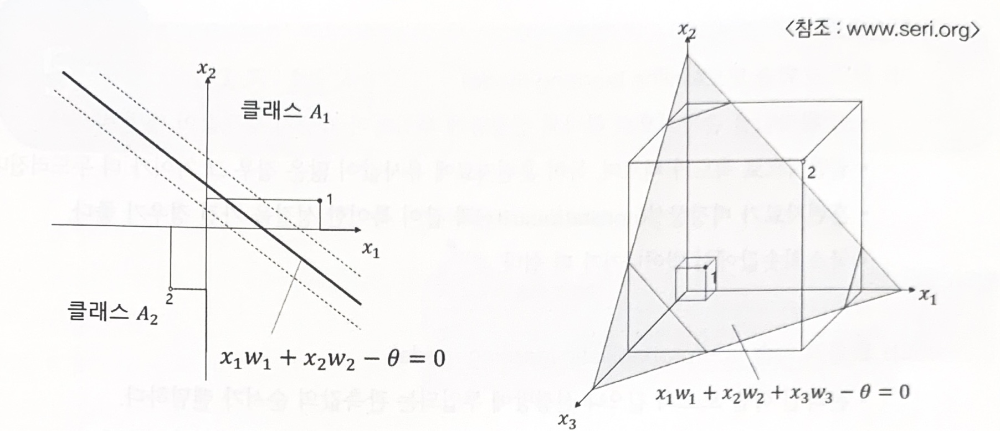

# 인공 신경망 분석

## 1. 인공신경망 분석(ANN)

### 가. 인공신경망이란?

- 인간 뇌를 기반으로 한 추론 모델
- 뉴런은 기본적인 정보처리 단위
    

 

### 나. 인공신경망 연구

- 로젠블럿(1955) : 퍼셉트론(Perceptron)이라는 **인공세포**를 개발
- 홉필드, 러멜하트, 맥클랜드 : **역전파알고리즘(Backpropagation)**을 활용하여 비선형성을 극복한 다층 퍼셉트론으로 새로운 인공신경망 모형이 등장

 

### 다. 인간의 뇌를 형상화한 인공신경망

1) 인간 뇌의 특징

- 100억개의 뉴런과 6조 개의 시냅스 결합체
- 현존하는 어떤 컴퓨터보다 빠르고 매우 복잡하고, 비선형적이며, 병렬적인 정보 처리 시스템과 같다
- 적응성에 따라 ‘잘못된 답’에 대한 뉴런들 사이의 연결은 약화되고, ‘올바른 답’에 대한 연결이 강화

2) 인간의 뇌 모델링

- 뉴런은 가중치가 있는 링크들로 연결되어 있다
- 뉴런은 여러 입력 신호를 받지만 출력 신호는 오직 하나만 생성
    
    
    
 

### 라. 인공 신경망 학습

- 신경망은 **가중치를 반복적으로 조정하며 학습**
- 뉴런은 링크(link)로 연결되어 있고, 각 링크에는 수치적인 가중치가 있다.
- 인공 신경망은 신경망의 가중치를 초기화하고 훈련 데이터를 통해 가중치를 갱신하여 신경망의 구조를 선택하고, 활용할 학습 알고리즘을 결정한 후 신경망을 훈련

 

### 마. 인공신경망의 특징

#### (1) 구조

- 입력 링크에서 여러 신호를 받아서 새로운 활성화 수준을 계산, 출력 링크로 출력 신호를 보냄
- 입력신호는 미가공 데이터 또는 다른 뉴런의 출력이 될 수 있다.
- 출력신호는 문제의 최종적인 해(solution)가 되거나 다른 뉴런에 입력될 수 있다.
    
    
    
 

#### (2) 뉴런의 계산

- 뉴런은 전이함수, 즉 활성화 함수(activation function)를 사용
- 활성화 함수를 이용해 출력을 결정하며 입력신호의 가중치 합을 계산하여 임계값과 비교
- 가중치 합이 임계값보다 작으면 뉴런의 출력은 -1, 같거나 크면 +1을 출력
    
    $X=\sum_{i=1}^nx_iw_i$
    
    $Y=\begin{cases} +1,\quad if \ X\ge\ \theta& \\ -1, \quad if\ X<\theta \end{cases}$
    
    - $X$는 뉴런으로 들어가는 입력의 순 가중합
    
    - $x_i$는 입력 $i$의 값
    
    - $w_i$는 입력 i의 가중치
    
    - $n$은 뉴런의 입력 개수
    
    - $Y$는 뉴런의 출력
    
 

#### (3) 뉴런의 활성화

- 시그모이드 함수의 경우 로지스틱 회귀분석과 유사하며, 0~1의 확률값을 가진다.
- 
    
    

- **softmax 함수** : 표준화지수 함수로도 불리며, 출력값이 여러 개로 주어지고 목표치가 다범주인 경우 각 범주에 속할 사후확률을 제공하는 함수
    
    
- Relu 함수: 입력값이 0이하는 0, 0이상은 x값을 가지는 함수이며, 최근 딥러닝에서 많이 활용하는 활성화 함수
    
    $Y^{relu}=\begin{cases} 0, \quad \ if \ x\le\ 0 & \\ x, \quad if\ x\ >0 \end{cases}$
    
 

#### (4) 단일 뉴런의 학습(단층 퍼셉트론)

- 퍼셉트론은 선형 결합기와 하드 리미터로 구성된다.
- 초평면(hyperplane)은 n차원 공간을 두 개의 영역으로 나눈다.
- 초평면을 선형 분리 함수로 정의한다.
  
  $\sum_{i=1}^nx_iw_i-\theta=0$
    
    
    
 

### 바. 신경망 모형 구축시 고려사항

#### (1) 입력 변수

- 신경망 모형은 그 복잡성으로 인하여 입력 자료의 선택에 매우 민감하다.
- 입력변수가 범주형 또는 연속형 변수일 때 아래의 조건이 신경망 모형에 적합하다.
    
    - 범주형 변수: 모든 범주에서 일정 빈도 이상의 값을 갖고 각 범주의 빈도가 일정할 때
    - 연속형 변수: 입력변수 값들의 범위가 변수간의 큰 차이가 없을 때
    
- 연속형 변수의 경우 그 분포가 평균을 중심으로 대칭이 아니면 좋지 않은 결과를 도출하기 때문에 아래와 같은 방법을 활용
    - 변환: 고객의 소득(대부분 평균미만이고 특정 고객의 소득이 매우 큰) → 로그변환
    - 범주화: 각 범주의 빈도가 비슷하게 되도록 설정

- 범주형 변수의 경우 가변수화하여 적용(남녀: 1, 0 또는 1, -1) 하고 가능하면 모든 범주형 변수는 같은 범위를 갖도록 가변수화 하는 것이 좋다.

 

#### (2) 가중치의 초기값과 다중 최소값 문제

- 역전파 알고리즘은 초기값에 따라 결과가 많이 달라지므로 초기값의 선택은 매우 중요한 문제
- 가중치가 0이면 시그모이드 함수는 선형이 되고 신경망 모형은 근사적으로 선형모형이 된다.
- 일반적으로 초기값은 0 근처로 랜덤하게 선택하므로 초기 모형은 선형에 가깝고, 가중치 값이 증가할수록 비선형모형이 된다.

 

#### (3) 학습모드

- 온라인 학습모드(online learning model)

  - 각 관측값을 순차적으로 하나씩 신경망에 투입하여 가중치 추정값이 매번 바뀐다.
  - 일반적으로 속도가 빠르며, 특히 훈련자료에 유사값이 많은 경우 그 차이가 더 두드러진다.
  - 훈련자료가 비정상성(nonstationarity)과 같이 특이한 성질을 가진 경우가 좋다
  - 국소최솟값에서 벗어나기가 더 쉽다

- 확률적 학습 모드(probabilistic learning model)

  - 온라인 학습 모드와 같으나 신경망에 투입되는 관측값의 순서가 랜덤

- 배치 학습 모드(batch learning model)
  - 전체 훈련 자료를 동시에 신경망에 투입한다.

 

#### (4) 은닉층(hidden layer)과 은닉노드(hidden node)의 수

- 신경망을 적용할 때 가장 중요한 부분이 모형의 선택(은닉층의 수와 은닉노드의 수 결정)
- 은닉층과 은닉노드가 많으면 가중치가 많아져서 과대 적합 문제 발생
- 은닉층과 은닉노드가 적으면 과소적합 문제 발생
- 은닉층의 수가 하나인 신경망은 범용 근사자이므로 모든 매끄러운 함수를 근사적으로 표현할 수 있다. 그러므로 가능하면 은닉층은 하나로 선정
- 은닉노드의 수는 적절히 큰 값으로 놓고 가중치를 감소시키며 적용하는 것이 좋다.

 

#### (5) 과대 적합 문제

- 신경망에서는 많은 가중치를 추정해야 하므로 과대적합 문제가 빈번하다
- 알고리즘의 조기종료와 가중치 감소 기법으로 해결할 수 있다
- 모형이 적합하는 과정에서 검증오차가 증가하기 시작하면 반복을 중지하는 조기종료를 시행한다.
- 선형모형의 능형회귀와 유사한 가중치 감소라는 벌점화 기법을 활용
