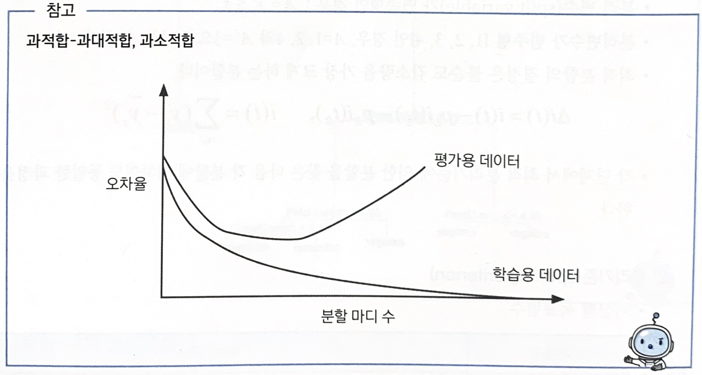
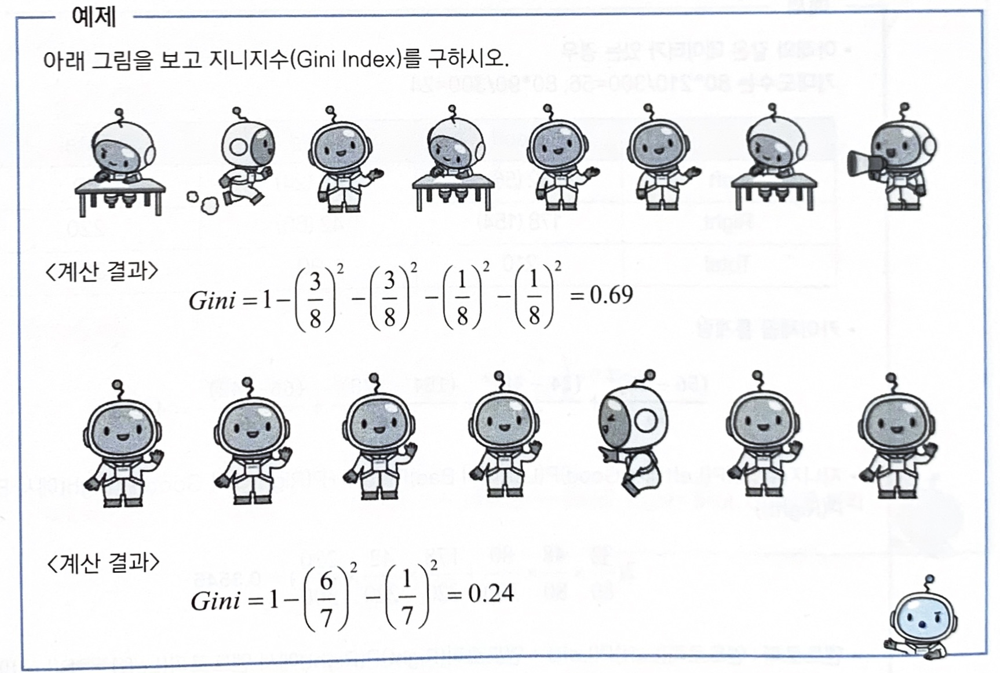
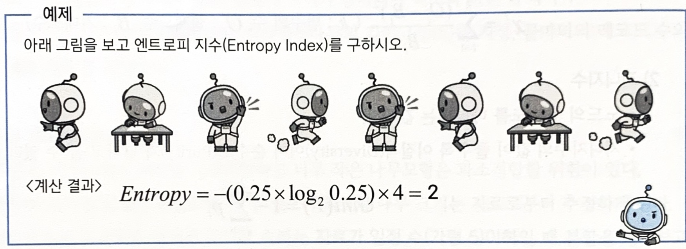

# 의사결정나무

## 1. 의사결정나무

### 가. 정의

- 의사결정나무는 분류함수를 의사결정 규칙으로 이뤄진 **나무 모양으로 그리는 방법**
- 나무구조는 연속적으로 발생하는 의사결정 문제를 **시각화**에 의해 의사결정이 이뤄지는 시점과 성과를 한눈에 볼 수 있게 한다.
- 계산결과가 의사결정나무에 직접 나타나기 때문에 해석이 간편
- 의사결정나무는 주어진 입력값에 대하여 출력값을 예측하는 모형으로 **분류나무**와 **회귀나무모형**이 있다.

 

### 나. 예측력과 해석력

- 기대 집단의 사람들 중 가장 많은 반응 보일 **고객의 유치방안을 예측**하고자 하는 경우에는 **예측력에 치중**
- 신용평가에서는 심사 결과 부적격 판정이 나온 경우 고객에게 부적격 **이유를 설명**해야 하므로 **해석력에 치중**

 

### 다. 의사결정나무의 활용

#### (1) 세분화

- 데이터를 비슷한 특성을 갖는 몇 개의 그룹으로 분할해 그룹별 특성을 발견하는 것이다.

#### (2) 분류

- 여러 예측변수들에 근거해 관측개체의 목표변수 범주를 몇 개의 등급으로 분류하고자 하는 경우

#### (3) 예측

- 자료에서 규칙을 찾아내고 이를 이용해 미래의 사건을 예측하고자 하는 경우

#### (4) 차원축소 및 변수선택

- 매우 많은 수의 예측변수 중에서 목표변수에 큰 영향을 미치는 변수들을 골라내고자 하는 경우

#### (5) 교호작용효과의 파악

- 여러 개의 예측변수들을 결합해 작용하는 규칙을 파악하고자 하는 경우

- 범주의 병합 또는 연속형 변수의 이산화

 

### 라. 의사결정나무의 특징

### 장점

- 결과를 누구에게나 설명하기 용이
- 모형을 만드는 방법이 계산적으로 복잡 ❌
- 대용량 데이터에서도 빠르게 만들 수 있다
- 비정상 잡음 데이터에 대해서도 민감함 없이 분류
- 한 변수와 상관성이 높은 다른 불필요한 변수가 있어도 크게 영향을 받지 않는다.
- 설명변수나 목표변수에 수치형변수와 범주형변수를 모두 사용 가능
- 모형 분류 정확도가 높다

### 단점

- 새로운 자료에 대한 **과대적합이 발생할 가능성**이 높다
- 분류 경계선 부근의 자료값에 대해서 오차가 크다
- 설명변수 간의 중요도를  판단하기 쉽지 않다.

 

### 마. 의사결정나무의 분석 과정

의사결정나무의 형성 과정은 크게 **성장(growing), 가지치기(pruning), 타당성 평가, 해석 및 예측**

#### (1) 성장 단계

- 각 마디에서 적잘한 최적의 `분리규칙`(splitting rule)을 찾아서 나무를 성장시키는 과정, 적절한 `정지규칙`(stopping rule)을 만족하면 중단

#### (2) 가지치기 단계

- 오차를 크게 할 위험이 높거나 부적절한 추론규칙을 가지고 있는 가지 또는 불필요한 가지를 `제거`하는 단계

#### (3) 타당성 평가 단계

- `이익도표`(gaun chart), `위험도표`(risk chart), 혹은 시험자료를 이용하여 의사결정나무를 평가

#### (4) 해석 및 예측 단계

- 구축된 나무모형을 해석하고 예측모형을 설정한 후 예측에 적용하는 단계

 

### 바. 나무의 성장

- 훈련자료를$(x_1, y_1) \quad i=1,2,\cdots,n$으로 나타내자 여기서 $x_i=(x_{i1},\cdots,x_{ip})$
- 나무모형의 성장과정은 $x$들로 이루어진 입력 공간을 재귀적으로 분할하는 과정이다.
    
    $R_1(j,A)=x_j\in A, \quad R_2=(j,A^c)=x_j\in A^c$

 

#### (1) 분리규칙(splitting rule)

- 분리 변수가 연속형인 경우 : $A = x_j \le s$

- 분리변수가 범주형 {1, 2, 3, 4}인 경우, $A=1,\ 2,\ 4$와 $A^c=3$으로 나눌 수 있다.
- 최적 분할의 결정은 불순도 감소량을 가장 크게 하는 분할이다.

    $\vartriangle i(t)=i(t)-p_Li(t_L)-p_R(i_R),\quad i(t)=\sum_{i\in t}(y_i-\bar{y_t})^2$
    
- 각 단계에서 최적 분리기준에 의한 분할을 찾은 다음 각 분할에 대하여도 동일한 과정을 반복한다.

#### (2) 분리기준

- 연속형 목표변수 (분리 변수가 연속형인 경우 : $A = x_j \le s$)
    
    
    | 기준값 | 분리기준 |
    | --- | --- |
    | 분산분석에서 F 통계량 | P값이 가장 작은 예측변수와 그 때의 최적분리에 의해서 자식마디를 형성 |
    | 분산의 감소량 | 분산의 감소량을 최대화 하는 기준의 최적분리에 의해서 자식마디를 형성 |

 

- 이산형 목표변수 (분리변수가 범주형 {1, 2, 3, 4}인 경우, $A=1,\ 2,\ 4$와 $A^c=3$으로 나눌 수 있다.)
    
    
    | 기준값 | 분리기준 |
    | --- | --- |
    | 카이제곱 통계량 p값 | P값이 가장 작은 예측변수와 그 때의 최적분리에 의해서 자식마디를 형성 |
    | 지니 지수 | 지니 지수를 감소시켜주는 예측변수와 그 때의 최적분리에 의해서 자식마디를 선택 |
    | 엔트로피 지수 | 엔트로피 지수가 가장 작은 예측 변수와 이때의 최적분리에 의해 자식마디를 형성 |

#### (3) 정지규칙(stopping rule)

- 더 이상 분리가 일어나지 않고, 현재의 마디가 끝마디가 되도록 하는 규칙
- **정지기준**(stopping criterion) : 의사결정나무의 깊이(depth)를 지정, 끝마디의 레코드 수의 최소 개수를 지정한다.

 

### 사. 나무의 가지치기(Pruning)

- 과대적합되어 현실 문제에 적응할 수 있는 적절한 규칙이 나오지 않는 현상을 방지하지 위해 사용되는 방법

- 너무 `큰` 나무 모형은 자료를 `과대적합`하고, 너무 `작은` 나무 모형은 `과소적합`할 가능성

- 나무의 크기를 모형의 복잡도로 볼 수 있으며 최적의 나무 크기는 자료로부터 추정

- 일반적으로 **자료가 일정 수(가령 5)** 이하 일 때 분할을 정지하고 `비용-복잡도 가지치기`(cost complexity pruning)를 이용하여 성장시킨 나무를 가지치기
    
    
    

  

## 2. 불순도의 여러 가지 측도

- 목표변수가 **범주형 변수**인 의사결정나무의 분류규칙을 선택하기 위해 `카이제곱 통계량`, `지니지수`, `엔트로피 지수`를 활용
    
    
### (1) 카이제곱 통계량
    
- 각 셀에 대한 ((실제도수-기대도수)의 제곱/기대도수)의 합
    - `기대도수` = 열의 합계 x 합의 합계 / 전체합계
            
        $z^2=\sum_{i=1}^k\frac{(B_i-O_i)^2}{B_i}$ ($k$ : 범주의 수, $O_i$ : 실제도수, $B_i$ : 기대도수)
            
    - p-value는 **높을수록 자식노드 간의 이질성이 낮다.** → 구분이 잘 안됨, 분류하기 어려움
    - 낮은 p-value 값을 선택해서 이질성이 큰 변수를 분류 (이질성이 크면 같은 게 많이 있다는 의미)
    
### (2) 지니지수
    
  - 노드의 **불순도**를 나타내는 값
  - 지니지수의 값이 클수록 이질적(Diversity)이며 **순수도(Purity)**가 낮다고 볼 수 있다. 순수도가 낮다 → 분류 잘 안됨
      
    ### $Gini(T) = 1-\sum_{l=1}^kP_l^2$
        
    

### (3) 엔트로피 지수

- 무질서 정도에 대한 측도
- 엔트로피 지수의 값이 클수록 **순수도**가 낮다고 볼 수 있다. 고로 지수의 값이 낮을 수록 분류 잘 됨.
- 엔트로피 지수가 가장 작은 예측변수와 이때의 최적분리 규칙에 의해 자식마디를 형성한다.
    
    $Entropy(T)=-(\sum^k_{l=1}p_l\log_2p_l)$
    
    
    

## 3. 의사결정나무 알고리즘

### 공통 개념
`하향식 기법`이 사용되며, 각 진행 단계에서는 주어진 데이터 집합을 가장 적합한 기준으로 분할하는 변수값이 선택된다.

#### CART(Classification and Regression Tree)

- 불손도의 측도로 출력(목적) 변수가 범주형일 경우 **지니지수**를 이용, 연속형인 경우 분산을 이용한 이진분리(binary split)를 사용
- 개별 입력변수 뿐만 아니라 입력변수들의 선형결합들 중에서 최적의 분리를 찾을 수 있다.

#### C4.5와 C5.0

- CART와는 다르게 각 마디에서 다지분리(multiple split)가 가능하며 범주형 입력변수에 대해서는 범주의 수만큼 분리가 일어난다.
- 불순도의 측도로는 **엔트로피 지수**를 활용한다.

#### CHAID(CHi-squared Automatic Interaction Detection)

- 가지치기를 하지 않고 적당한 크기에서 나무모형의 성장을 주입하며 입력변수가 반드시 범주형 변수이어야 한다.
- 분순도의 측도로는 **카이제곱 통계량**을 사용한다.
- 