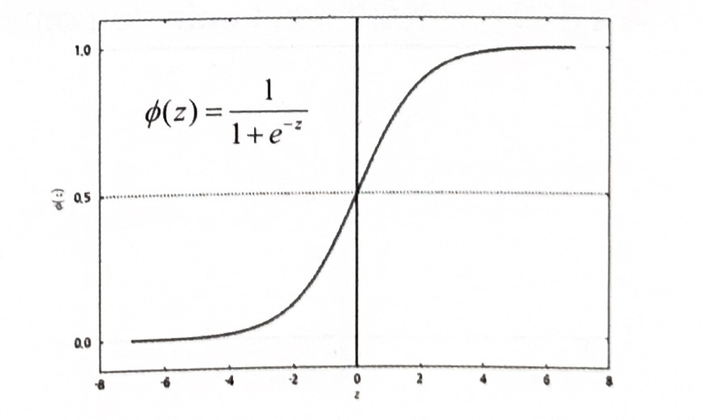
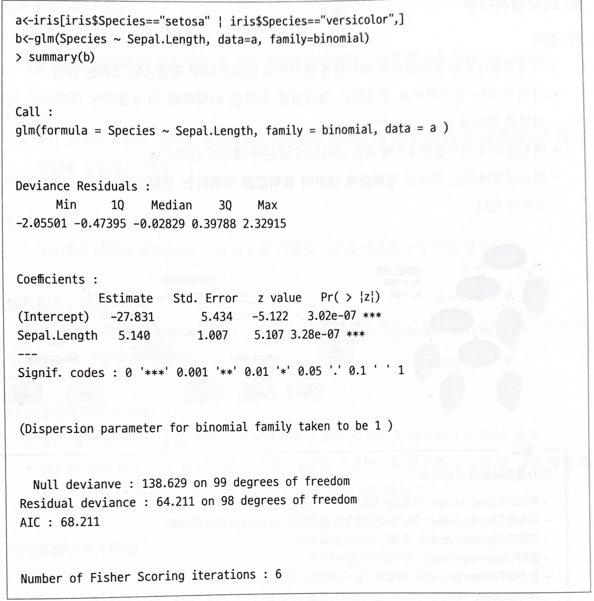

# 로지스틱 회귀분석(Logistic Regression)

- 반응변수가 `범주형`인 경우에 적용되는 회귀분석모형
  
- 새로운 설명변수가 주어질 때 반응변수의 각 범주(또는 집단)에 속할 확률이 얼마인지를 추정(예측모형)하여, 추정 확률을 기준치에 따라 분류하는 목적(분류모형)으로 활용
  
- 이때 모형의 적합을 통해 추정된 확률을 **사후확률(Posterior Probability)**이라고 한다.
    
    $\log(\frac{R(y)}{1-P(y)})-\alpha+\beta_1x_1+\cdots+\beta_kx_k\\P(y)=P(y=1|x), \ x=(x_1,\cdots, x_k)$
    

- exp($\beta_1$)의 의미는 나머지 변수($x_1, \cdots, x_k$)가 주어질 때, $x_1$이 한 단위 증가할 대마다 성공(Y=1)의 `오즈`가 몇 배 증가하는지를 나타내는 값
    
    $P(y)=\frac{exp(\alpha+\beta_1x_1+\cdots+\beta_kx_k)}{1+exp(\alpha+\beta_1x_1+\cdots+\beta_kx_k)} = \frac{1}{1+exp[-(\alpha+\beta_1x_1+\cdots+\beta_kx_k)}$
    
- $P(y)$ 식은 다중로지스틱 회귀모형이며, 아래 그래프의 형태는 설명변수가 한 개($x_1$)인 경우 해당 회귀 계수 $\beta_1$의 부호에 따라 S자 모양($\beta_1>0)$ 또는 역 S자 모양($\beta_1<0)$을 가진다.
  

    
    
- 표준 로지스틱 분포의 누적분포함수(c.d.f)를 F(x)라 할 때, $P(y)=F(\alpha+\beta_1x_1+\cdots+\beta_kx_k)$ 이 식과 동일한 표현이며, 표준 로지스틱 분포의 누적분포함수로 성공의 확률을 추정
    
- `오즈비(odds ratio)`: 오즈(odds)는 성공할 확률이 실패할 확률의 몇 배인지를 나타내는 확률이며, 오즈비(odds ratio)는 오즈의 비율
    
    | 구분 | 16강 진출 확률 | 16강 탈락 확률 |
    | --- | --- | --- |
    | Brazil | 0.8 | 0.2 |
    | Korea | 0.1 | 0.9 |
    
    - Odds(Brazil) = 0.8/(1-0.8) = 0.8 / 0.2 = 4,  Odds(Korea) = 0.1 / (1-0.1) = 1 / 9
    
    - Odds ratio = Odds(Brazil)/Odds(Korea) = $\frac{4}{1/9} =36$
    
    - 브라질이 16강에 진출할 확률이 한국의 16강 진출 확률보다 36배 높다고 볼 수 있다.
    
 
    
- 선형회귀분석과 로지스틱 회귀분석의 비교
    
    
    | 목적 | 선형회귀분석 | 로지스틱 회귀분석 |
    | --- | --- | --- |
    | 종속변수 | 연속형 변수 | (0, 1) |
    | 계수 추정법 | 최고제곱법 | 최대우도추정법 |
    | 모형 검정 | F-검정, t-검정 | 카이제곱 검정(x제곱 test) |

 

- `glm()` 함수를 활용해 로지스틱 회귀분석 실행
- R 코드: `glm`(종속변수 ~ 독립변수1 + ・・・ + 독립변수k, family = `binomial`, data = 데이터셋)
    
    
    
    < R 프로그램 결과 해석>
    
    - `종속변수`: Species
  
    - `독립변수`: Sepal.Length
    - Sepal.Length가 한 단위 증가함에 따라 Species(Y)가 1에서 2로 바뀔 때 오즈가 exp(5.140) ≈ 170배 증가한다.
    - Null deviance는 절편만 포함하는 모형의 완전 모형으로부터의 이탈도(deviance)를 나타내며 p-값  $= P(x^2(99)>138.629)\approx0.005$ 으로 통계적으로 유의하므로 적합결여를 나타낸다.
    - Residual deviance는 예측변수 Sepal.Length가 추가된 적합 모형의 이탈도를 나타낸다. Null decuance에 비해 자유도 1 기준에 이탈도의 감소가 74.4 정도의 큰 감소를 보이며, p-값$=P(x^2(98)>64.211)\approx0.997$으로 통계적으로 유의하지 못해 귀무가설을 기각하지 못한다.
    - 따라서 적합값이 관측된 자료를 `잘 적합`한다고 말할 수 있다.
  