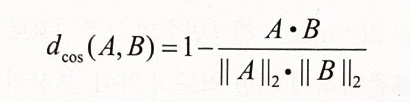

# 군집분석

## 1. 군집분석

### 가. 개요

- 각 객체(대상)의 유사성을 측정하여 유사성이 높은 대상 집단을 분류하고, 군집에 속한 객체들의 유사성과 서로 다른 군집에 속한 객체간의 상이성을 규명하는 분석 방법

- 특성에 따라 고객을 여러 개의 배타적인 집단으로 나누는 것
  
- 결과는 구체적인 군집분석 방법에 따라 차이가 나타날 수 있다
  
- 군집의 개수나 구조에 대한 가정 없이 데이터들 사이의 거리를 기준으로 군집화를 유도한다.
    
    
    
 

### 나. 특징

#### (1) 요인분석과의 차이점

- 요인분석은 유사한 변수를 함께 묶어주는 것이 목적

#### (2) 판별분석과의 차이점

- 판별분석은 사전에 집단이 나누어져 있는 자료를 통해 새로운 데이터를 기존의 집단에 할당하는 것이 목표

 

## 2. 거리

군집분석에서는 관측 데이터 간 유사성이나 근접성을 측정해 어느 군집으로 묶을 수 있는지 판단해야 한다.

### 가. 연속형 변수의 경우

- 유클리디안 거리(Euclidean distance)
    - 데이터간의 유사성을 측정할 때 많이 사용하는 거리.
    - 통계적 개념이 내포되어 있지 않아 변수들의 산포 정도가 감안되지 않는다.
        
        $d(x, y)=\sqrt{(x_1-y_1)^2+\cdots+(x_p-y_p)^2}=\sqrt{(x-y)'(x-y)}$
        

- 표준화 거리(statistical distance)
    - 해당 변수의 표준편차로 척도 변환 후 유클리디안 거리를 계산하는 방법. 표준화하게 되면 척도의 차이, 분산의 차이로 인한 왜곡을 피할 수 있다.
        
        $d(x, y)=\sqrt{(x-y)'D^{-1}(x-y)},\ D=diag\left\{s_{11},\cdots,s_{pp}\right\}$
        

- 마할라노비스 거리
    - 통계적 개념이 포함된 거리, 변수들의 산포를 고려하여 이를 표준화한 거리(변수의 표준화와 변수 간의 상관성을 동시에 고려)
    - 두 벡터 사이의 거리를 간포를 의미하는 표본공분산으로 나눠주어야 하며, 그룹에 대한 사전 지식 없이는 표본공분산S를 계산할 수 없으므로 사용하기 곤란하다.
        
        $d(x, y)=\sqrt{(x-y)'S^{-1}(x-y)},\ S=\left\{S_{ij}\right\}$ 는 공분산행렬
        

- 체비셰프 거리
    
    $d(x,y)=max_i\left| x_i-y_i\right|$

- 맨하탄 거리
    - 유클리디안 거리와 함께 가장 많이 사용되는 거리
        
        $d(x,y)=\sum_{i=1}^p\left| x_i-y_i\right|$
        

- 캔버라 거리
    
    $d(x,y)=\sum_{i=1}^p \frac{\left| x_i-y_i\right|}{(x_i+y_i)}$
    

- 민코우스키 거리
    - 맨하탄 거리와 유클리디안 거리를 한 번에 표현한 공식으로 L1 거리(맨하탄 거리), L2 거리(유클리디안 거리)라 불리고 있다.
        
        
    
    **연속형 변수**

    유클리디안 거리, 표준화 거리, 마할라노비스 거리, 체비셰프 거리, 맨하탄 거리, 캔버라 거리, 민코우스키 거리

 

### 나. 범주형 변수의 경우

- 자카드 거리
        
    

- 자카드 계수
    
    
    

- 코사인 거리: 문서를 유사도를 기준으로 분류 혹은 그룹핑 할 때 유사하게 사용
    
    
    

- 코사인 유사도: 두 개체의 백터 내적의 코사인 값을 이용하여 측정된 벡터간의 유사한 정도.
    
    → “두 개체의 벡터 내적을 기반하여 ~”
    
    
    
    
    
    **범주형 변수**
    
    자카드 거리, 자카드 계수, 코사인 거리, 코사인 유사도

