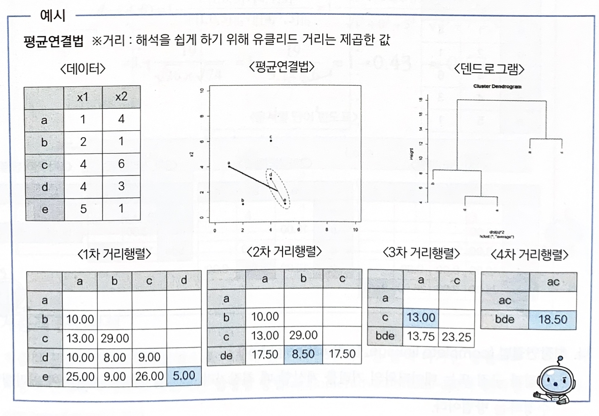

# 계층적 군집분석

- 계층적 군집방법은 n개의 군집으로 시작해 점차 군집의 개수를 줄여 나가는 방법이다.
- 계층적 군집을 형성하는 방법에는 `합병형 방법`(agglomerative: bottom_up)과 `분리형 방법`(Divisive: top-down)이 있다.
    
    
    
 

### 가. 최단연결법(single linkage, nearest neighbor)

- n*n 거리행렬에서 거리가 가장 가까운 데이터를 묶어서 군집을 형성
- 군집과 군집 또는 데이터와의 거리를 계산 시 최단거리(min)를 계산하여 거리행렬 수정을 진행
- 수정된 거리행렬에서 거리가 가까운 데이터 또는 군집을 새로운 군집으로 형성
    
    
    
 

### 나. 최장연결법(complete linkage, farthest neighbor)

- 군집과 군집 또는 데이터와의 거리를 계산할 때 최장거리(max)를 거리로 계산하여 거리행렬을 수정하는 방법
    
    
    
 

### 다. 평균연결법(average linkage)

- 군집과 군집 또는 데이터와의 거리를 계산할 때 평균(mean)을 거리로 계산하여 거리행렬을 수정하는 방법
    
    
    
 

### 라. 와드연결법(ward linkage)

- 군집 내 편차들의 제곱합을 고려한 방법
- 군집 간 정보의 손실을 최소화하기 위해 군집화를 진행한다.

    

- 계층적 군집분석
    
    두 군집을 병합하는 방법 가운데 병합된 군집의 오차제곱합이 병합 이전 군집의 오차제곱합의 합에 비해 증가한 정도가 작아지는 방향으로 군집을 형성
    
 

### 마. 군집화

- 거리행렬을 통해 가장 가까운 거리의 객체들간의 관계를 규명하고 덴드로그램을 그린다.
- 덴드로그램을 보고 군집의 개수를 변화해 가면서 적절한 군집 수를 선정한다.
- 군집의 수는 분석 목적에 따라 선정할 수 있지만 대부분 5개 이상의 군집은 잘 활용하지 않는다.
- 군집화 단계
    1. 거리 행렬을 기준으로 덴드로그램을 그린다.
    2. 덴드로그램의 최상단부터 세로축의 개수에 따라 가로선을 그어 군집의 개수를 선택
    3. 각 개체들의 구성을 고려해서 적절한 군집수를 선정
    
    
    