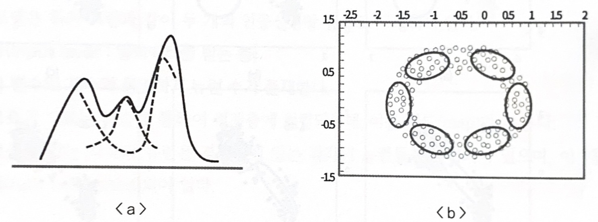
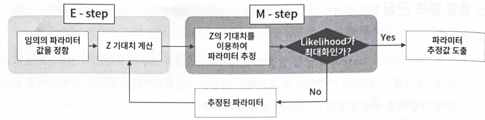
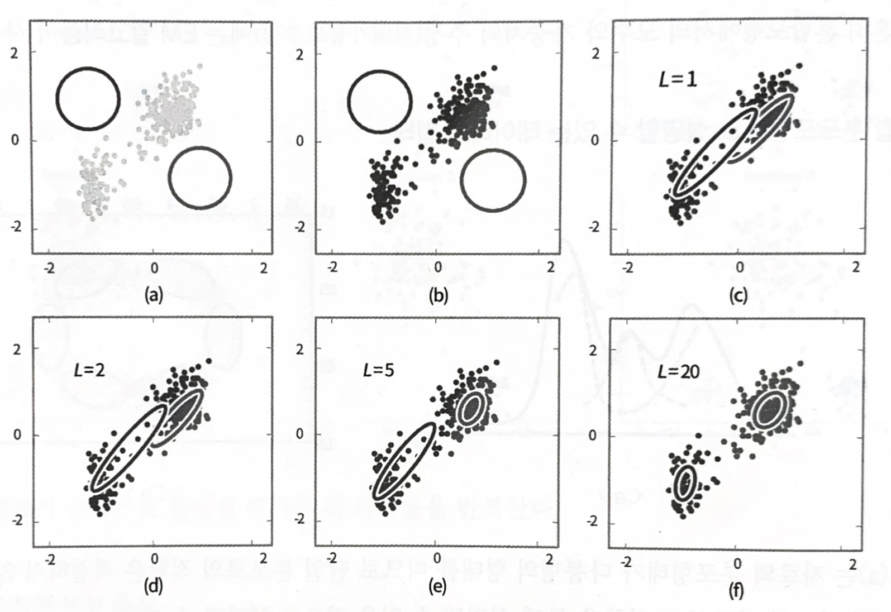
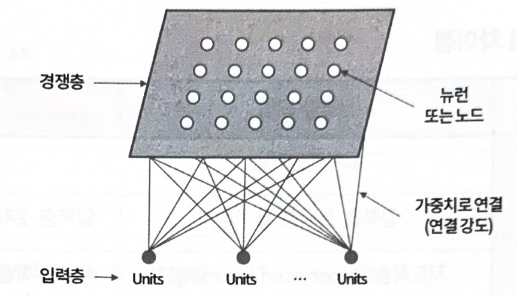
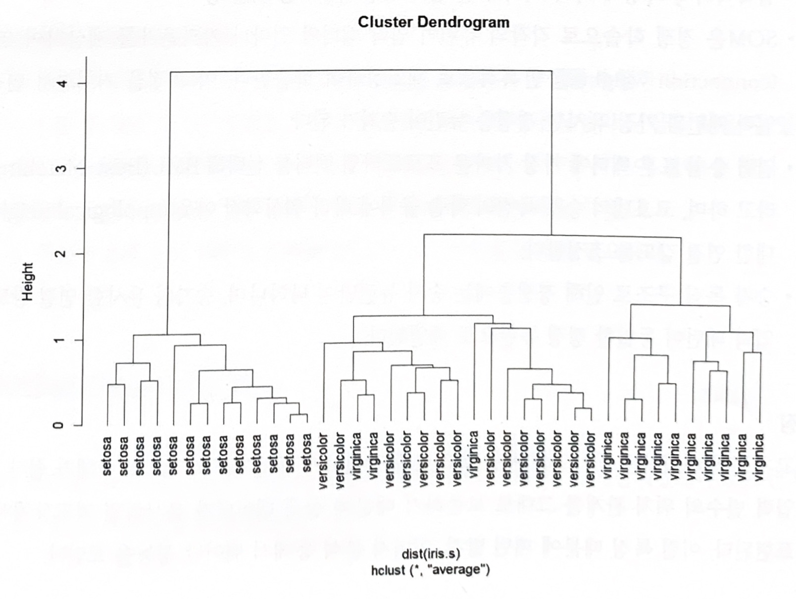
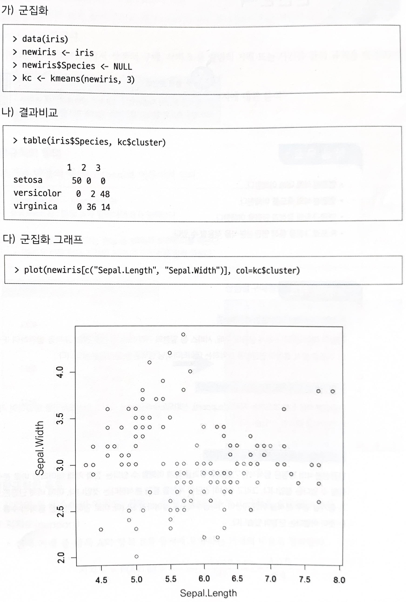

# 혼합 분포 군집, SOM

## 혼합 분포 군집

### 가. 개요

- 모형 기반(model-based)의 군집 방법이며, 데이터가 k개의 모수적 모형(흔히 정규분포 또는 다변량 정규분포 가정함)의 가중합으로 표현되는 모집단 모형으로부터 나왔다는 가정하에서 모수와 함께 가중치를 자료로부터 추정하는 방법을 사용

- K개의 각 모형은 군집을 의미하며, 각 데아터는 추정된 k개의 모형 중 어느 모형으로부터 나왔을 확률이 높은지에 따라 군집의 분류가 이루어진다.

- 흔히 혼합모형에서의 모수와 가중치의 추정(최대가능도추정)에는 `EM 알고리즘`이 사용된다.

 

### 나. 혼합 분포모형으로 설명할 수 있는 데이터의 형태

- `<a>`는 자료의 분포형태가 다봉형의 형태를 띠므로 단일 분포로의 적합은 적절하지 않으며, 대략 3개 정도의 정규분포 결합을 통해 설명될 수 있을 것으로 생각할 수 있다.
- `<b>`의 경우에도 여러 개의 이변량 정규분포의 결합을 통해 설명될 수 있을 것. 두 경우 모두 반드시 정규분포로 제한할 필요는 없다.

 

### 다. EM(Expectation-Maximization)알고리즘의 진행 과정

- k개의 각 모형은 군집을 의미하며 이 혼합모형의 모수와 가중치의 최대가능도 추정에 사용되는 알고리즘

- 각 자료에 대해 Z의 조건부분포(어느 집단에 속할 지에 대한)로부터 조건부 기댓값을 구할 수 있다.
  
- 관측변수 X와 잠재변수 Z를 포함하는 (X,Z)에 대한 로그-가능도함수(이를 보정된 로그-가능도함수라 함)에 Z 대신 상수값인 Z의 조건부 기댓값을 대입하면, 로그-가능도함수를 최대로 하는 모수를 쉽게 찾을 수 있다.
- (M-단계) 갱신된 모수 추정치에 대해 위 과정을 반복한다면 수렴하는 값을 얻게 되고, 이는 최대 가능도 추정치로 사용될 수 있다.
- E - 단계: 잠재변수 Z의 기대치 계산
- M - 단계: 잠재변수 Z의 기대치를 이용하여 파라미터를 추정
    
    
    
    

- 혼합 분포 군집모형의 특징
    - K-평균군집의 절차와 유사하지만 **확률분포를 도입하여 군집을 수행**한다.
    - 군집을 몇 개의 모수로 표현할 수 있으며, 서로 다른 크기나 모양의 군집을 찾을 수 있다.
    - EM 알고리즘을 이용한 모수 추정에서 데이터가 커지면 수렴에 시간이 걸릴 수 있다.
    - 군집의 크기가 너무 작으면 추정의 정도가 떨어지거나 어려울 수 있다.
    - K-평균군집과 같이 **이상치 자료에 민감**하므로 사전에 조치가 필요하다.
    
  

## SOM(Self Organizing Map)

### 가. 개요

- `자기조직화지도(SOM)` 알고리즘은 코호넨(Kohonen)에 의해 제시, 개발되었으며 코호넨 맵(Kohonen Maps)이라고도 알려져 있다.
- `SOM`은 비지도 신경망으로 **고차원의 데이터를 이해하기 쉬운 저차원의 뉴런으로 정렬**하여 지도의 형태로 형상화. 이러한 형상화는 입력 변수의 위치 관계를 그대로 보존한다는 특징이 있다. 다시 말해 실제 공간의 입력 변수가 가까이 있으면, 지도상에도 가까운 위치에 있게 된다.
    
    
    

### 나. 구성

- SOM 모델은 위의 그림과 같이 두 개의 인공신경망 층으로 구성되어 있다.
#### 입력층(Input layer: 입력벡터를 받는 층)
- 입력 변수의 개수와 동일하게 뉴런 수가 존재

- 입력층의 자료는 학습을 통하여 경쟁층에 정렬되는데, 이를 지도(map)라 부른다.
  
- 입력층에 있는 각각의 뉴런은 경쟁층에 있는 각각의 뉴런들과 연결되어 있으며, 이때 완전 연결(fully connected)되어 있다.

 

#### 경쟁층(competitve layer: 2차원 격자(grid)로 구성된 층)
- 입력벡터의 특성에 따라 벡터가 한 점으로 클러스터링 되는 층

- SOM은 경쟁 학습으로 각각의 뉴런이 입력 벡터와 얼마나 가까운가를 계산하여 연결 강도(connection weight)를 반복적으로 재조정하여 학습한다.

- 입력 층의 표본 벡터에 가장 가까운 프로토타입 벡터를 선택해 `BMU(Best-Matching-Unit)`라고 하며, 코호넨의 승자 독점의 학습 규칙에 따라 **위상학적 이웃**에 대한 연결 강도를 조정한다.
 
- 승자 독식 구조로 인해 경쟁층에는 승자 뉴런만이 나타나며, 승자와 유사한 연결 강도를 갖는 입력 패턴이 동일한 경쟁 뉴런으로 배열된다.

 

### 다. 특징

- 고차원의 데이터를 저차원의 **지도 형태로 형상화**하기 때문에 시각적으로 이해가 쉽다.
- 입력 변수의 위치 관계를 그대로 보존하기 때문에 실제 데이터가 유사하면 지도상에서 가깝게 표현된다. 이런 특징 때문에 패턴 발견, 이미지 분석 등에서 뛰어난 성능을 보인다.
- 역전파 알고리즘 등을 이용하는 인공신경망과 달리 단 하나의 **전방 패스(feed-forward flow)**를 사용함으로써 속도가 매우 빠르다. 따라서, 실시간 학습처리를 할 수 있는 모형이다.

 

### 라. SOM과 신경망 모형의 차이점

| 구분 | 신경망 모형 | SOM |
| --- | --- | --- |
| 학습 방법 | 오차역전파법 | 경쟁학습방법 |
| 구성 | 입력층, 은닉층, 출력층 | 입력층, 2차원 격자(grid) 형태의 경쟁층 |
| 기계 학습 방법의 분류 | 지도학습(Supervised Learning) | 비지도 학습(Unsupervised Learning) |

 

# 7. 최신 군집분석 기법들

### 가. iris 데이터를 활용한 기법 확인

#### (1) Hierarchical Clustering

**2) K-means Clustering**

- 비계층적 군집방법으로 사용가능
    
    