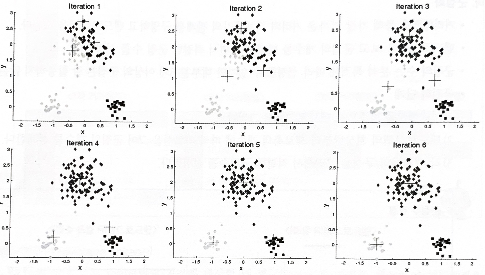

# 분할적(비계층적) 군집분석

n개의 개체를 g개의 군집으로 나눌 수 있는 모든 가능한 방법을 점검해 최적화한 군집을 형성하는 것

비계층적 군집분석인 k-means 군집분석 방식의 수행 방식과 장단점

### 가. k-means 군집분석(clustering)의 개념

- 주어진 데이터를 k개의 클러스터로 묶는 알고리즘으로, 각 클러스터와 거리 차이의 분산을 최소화하는 방식으로 동작.

 

### 나. k-means 군집분석 과정

- 원하는 군집의 **개수**와 **초기 값(seed)**들을 정해 seed 중심으로 군집을 형성
- 각 데이터를 거리가 가장 가까운 seed가 있는 군집으로 분류
- 각 군집의 seed 값을 다시 계산
    
    
    
- 모든 개체가 군집으로 할당될 때까지 위 과정을 반복

 

### 다. k-평균 군집분석의 특징

- 거리 계산을 통해 군집화가 이루어지므로 **연속형 변수에 활용이 가능**하다.

- 한 번 군집이 형성되더라도 다른 군집으로 이동이 가능하다

- K개의 **초기 중심값은 임의로 선택이 가능**하며 가급적이면 멀리 떨어지는 것이 바람직하다.

- 초기 중심값을 임의로 선택할 때 일렬(위아래, 좌우)로 선택하면 군집 혼합되지 않고 층으로 나누어질 수 있어 주의하여야 한다. **초기 중심값의 선정에 따라 결과가 달라**질 수 있다.

- 초기 중심으로부터의 오차 제곱합을 최소화하는 방향으로 군집이 형성되는 **탐욕적(greedy) 알고리즘**이므로 안정된 군집은 보장하나 최적이라는 보장은 없다.

#### <장점>

- 알고리즘이 단순, 빠르게 수행 → 분석 방법 적용이 용이
- 계층적 군집분석에 비해 많은 양의 데이터를 다룰 수 있다.
- 내부 구조에 대한 사전정보가 없어도 의미 있는 자료구조를 찾을 수 있다.
- 다양한 형태의 데이터에 적용이 가능

#### <단점>

- 군집의 수, 가중치와 거리 정의가 어렵다.
- 사전에 주어진 목적이 없으므로 결과 해석이 어렵다.
- 잡음이나 이상값의 영향을 많이 받는다.
- 볼록한 형태가 아닌(non-convex) 군집이(예를 들어 U형태의 군집) 존재할 경우 성능이 저하
- 초기 군집수 결정에 어려움
- 변수의 크기에 영향을 받음에 따라 정규화 과정이 필수적 → 원데이터의 분포를 유지하면서 정규화가 가능한 min-max 정규화 수행

 

### 라. K-medoids Clustering

- 비계층적 군집분석 기법의 경우 이상값에 민감하여 군집 경계의 설정이 어렵다는 단점 존재. 이러한 단점을 극복하기 위해 등장한 비계층적 군집 방법
- 평균은 이상치에 민감한데 이를 보완하기 위해 군집의 가장 중심에 있는 값(메도이드, 중앙값 **medoid**)을 사용하여 군집을 찾는 방법
