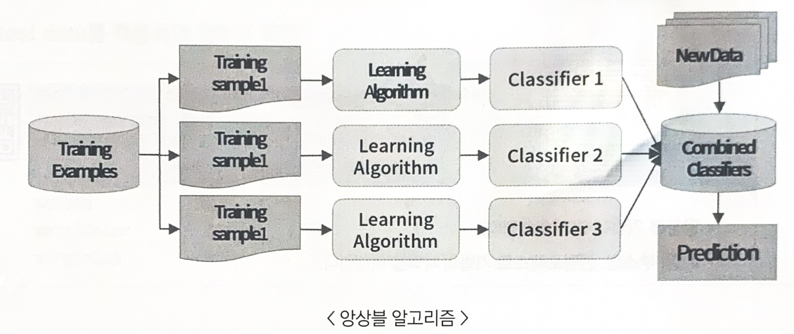
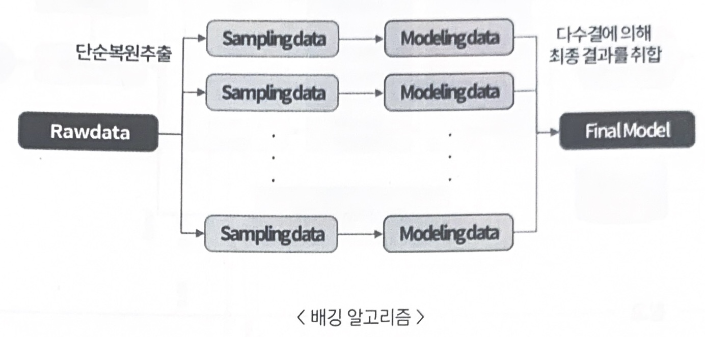
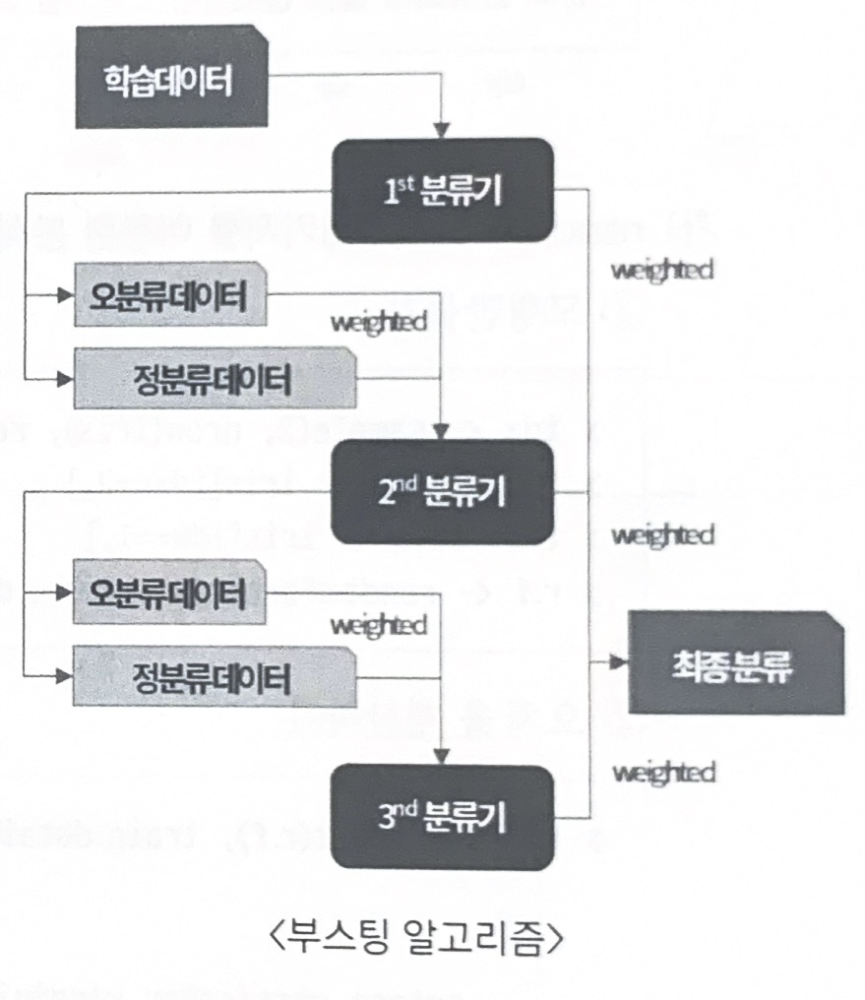
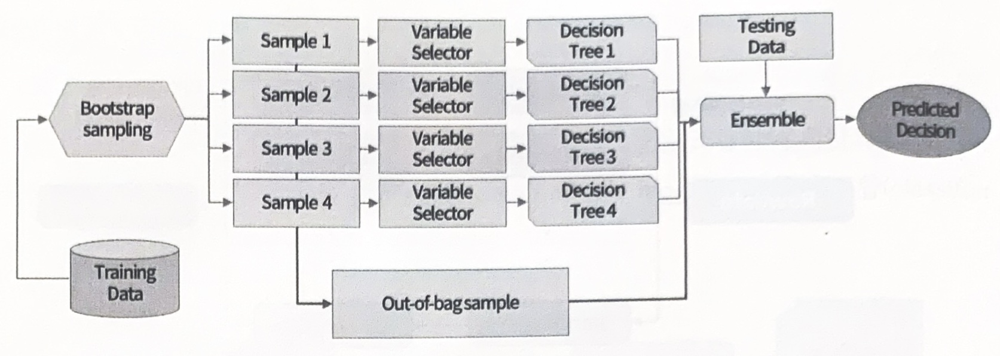
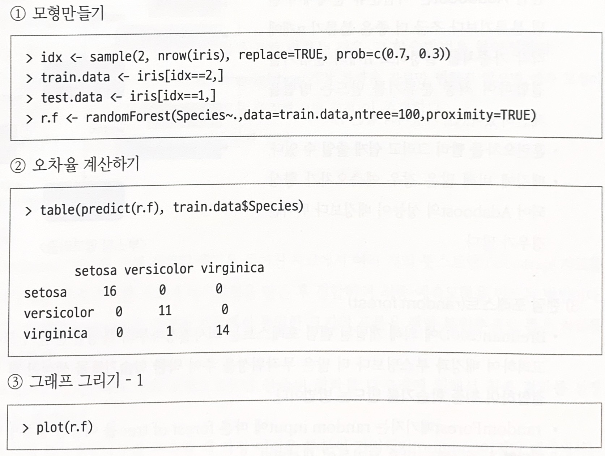
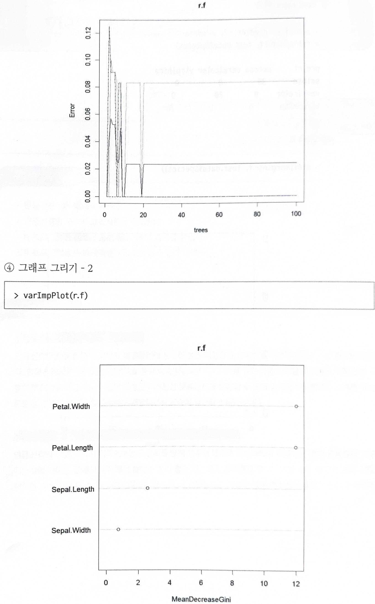
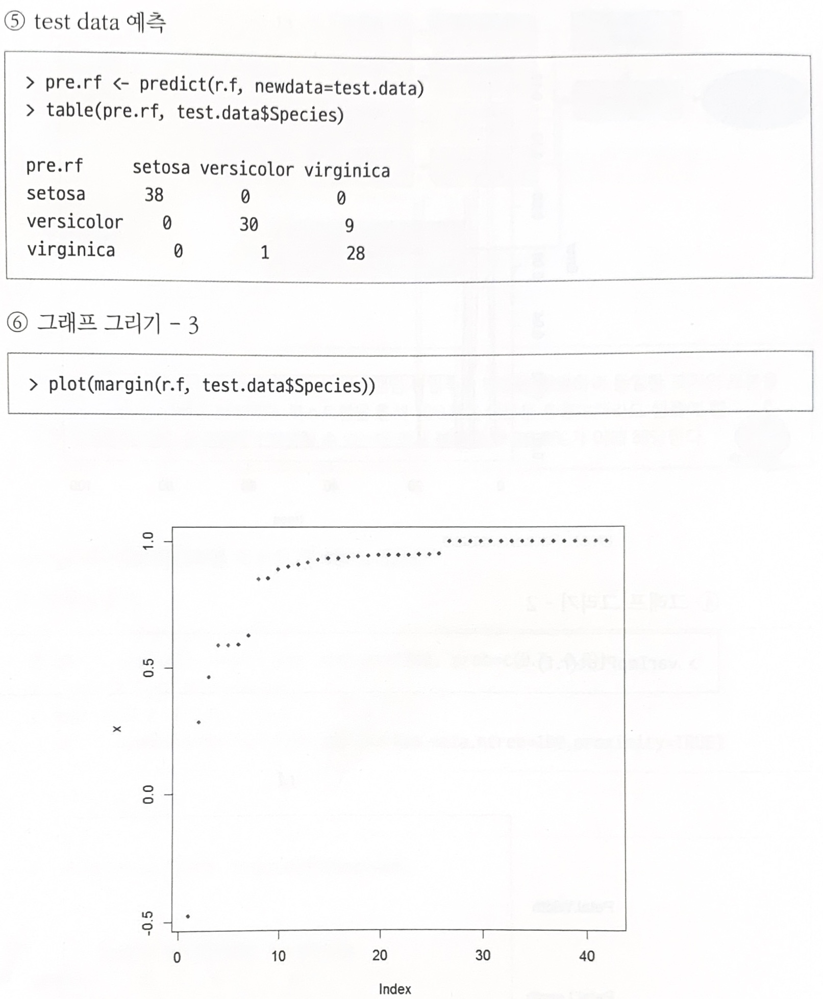

# 앙상블분석

## 1. 앙상블(Ensemble)

### 가. 정의

주어진 자료로부터 여러 개의 예측모형들을 만든 후g 예측모형들을 조합하여 하나의 최종 예측모형을 만드는 방법으로 `다중 모델 조합`(combining multiple models), `분류기 조합`(classifier combination)이 있다.

- 이상값(outlier)에 대한 대응력이 높아진다.
- 전체적인 예측값의 분산을 감소시켜 정확도를 높일 수 있다.
- 모형의 투명성이 떨어져 원인 분석에는 적합하지 않다.
- 각 호명의 상호 연관성이 높을수록 정확도가 향상된다.

 

### 나. 학습방법의 불안정성

- 학습자료의 작은 변화에 의해 예측모형이 크게 변하는 경우, 그 학습방법은 불안정하다.
- 가장 안정적인 방법으로는 1-nearest neighbot(가장 가까운 자료만 변하지 않으면 예측 모형이 변하지 않음), 선형회귀모형(최소제곱법으로 추정해 모형 결정)이 존재한다.
- 가장 불안정한 방법으로는 의사결정나무가 있다.

 

### 다. 앙상블 기법의 종류

#### (1)배깅

- Breiman(1994) → 주어진 자료에서 여러 개의 **붓스트랩(bootstrap)** 자료를 생성하고 각 붓스트랩 자료에 예측모형을 만든 후 결합하여 최종 예측모형을 만드는 방법
  
  - 붓스트랩은 주어진 자료에서 동일한 크기의 표본을 랜덤 복원부출로 뽑은 자료를 의미
    
  - 원 데이터 집합으로부터 크기가 같은 표본을 여러 번 단순 임의 복원 추출하여 각 표본에 대해 분류기를 생성한 후 그 결과를 앙상블하는방법
    
- 보팅(voting)은 여러 개의 모형으로부터 산출된 결과를 다수결에 의해서 최종 결과를 선정하는 과정이다.
- 최적의 의사결정나무를 구축할 때 가장 어려운 부분이 가지치기(pruning)이지만 **배깅에서는 가지치기를 하지 않고 최대로 성장한 의사결정나무들을 활용한다.**
- 훈련자료의 모집단의 분포를 모르기 때문에 실제 문제에서는 평균예측모형을 구할 수 없다. 배깅은 이러한 문제를 해결하기 위해 **훈련자료를 모집단으로 생각하고 평균예측모형을 구하여 분산을 줄이고 예측력을 향상시킬 수 있다.**

    

참고

붓스트랩은 주어진 자료에서 단순랜덤 복원추출 방법을 활용하여 동일한 크기의 표본을 여러개 생성하는 샘플링 방법. 붓스트랩을 통해 100개의 샘플을 추출하더라도 **샘플에 한 번도 선택되지 않는 원데이터**가 발생할 수 있는데, 전체 샘플의 `36.8%`가 이에 해당한다.

 

#### (2) 부스팅

- 붓스트랩 표본을 구성하는 재표본 과정에서 분류가 잘못된 데이터에 더 큰 가중치를 주어 표본을 추출하는 기법
예측력이 약한 모형(weak learner)들을 결합 → 강한 예측모형 생성
- Fruend&Schapire → **Adaboost**는 이진분류 문제에서 랜덤 분류기보다 조금 더 좋은 분류기 n개에 각각 가중치를 설정하고 n개의 분류기를 결합하여 최종 분류기를 만드는 방법
- 훈련오차를 빨리 그리고 쉽게 줄일 수 있다.(단 가중치의 합은 1)
- 배깅에 비해 많은 경우 예측오차가 향상되어 Adaboost의 성능이 배깅보다 뛰어난 경우가 많다.
    
    

 

#### (3) 랜덤 포레스트(random forest)

- Breiman(2001) → **랜덤 포레스트**는 의사결정나무의 특징인 분산이 크다는 점을 고려하여 배깅과 부스팅보다 더 많은 무작위성을 주어 약한 학습기들을 생성한 후 이를 선형 결합하여 최종 학습기를 만드는 방법

- `randomForest`패키지는 `random input`에 따른 `forest of tree`를 이용한 분류방법
- 랜덤한 forest에는 많은 트리들이 생성된다.
- 수천 개의 변수를 통해 변수제거 없이 실행되므로 정확도 측면에서 좋은 성과를 보인다.
- 이론적 설명이나 최종 결과에 대한 해석이 어렵다는 단점이 있지만 예측력이 매우 높은 것으로 알려져 있다. 특히 입력변수가 많은 경우, 배깅과 부스팅과 비슷하거나 좋은 예측력을 보인다.
    
    

- randomForest 패키지를 이용한 분석(iris data)
    
    
    
    