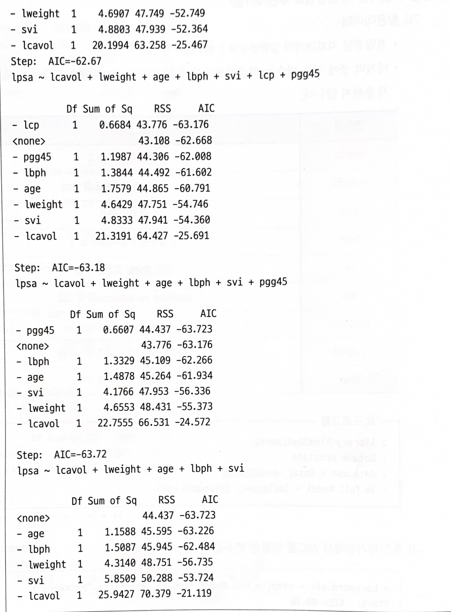

# 최적회귀방정식

## 가. 최적회귀방정식의 선택

### 1) 설명변수 선택

- 필요한 변수만 상황에 따라 타협을 통해 선택
- $y$에 영향을 미칠 수 있는 모든 설명변수 $x$들은 $y$의 값 예측에 참여
- 데이터에 설명변수 $x$들의 수가 많아지면 관리하는데 많은 노력이 요구되므로, **가능한 범위 내에서 적은 수의 설명변수를 포함한다.**

 

### 2) 모형선택(exploratory analysis)

- 분석 데이터에 가장 잘 맞는 모형을 찾아내는 방법
- 모든 가능한 조합의 회귀분석(All possible regression):
  
  모든 가능한 독립변수들의 조합에 대한 회귀모형을 생성한 뒤 가장 적합한 회귀모형을 선택

 

### 3) 단계적 변수선택(Stepwise Variable Selection)

**전진 선택법(forward selection)**
  - 절편만 있는 상수모형으로부터 시작해 `중요`하다고 생각되는 설명변수부터 `차례로 모형에 추가`
  - 이해하기 쉽고 변수의 개수가 많은 경우에도 사용 가능하지만 변수값의 작은 변동에도 그 결과가 크게 달라져 안전성이 부족한 단점
  
 

**후진 제거법(backward selection)**
  - 독립변수 후보 모두를 포함한 모형에서 출발해 가장 `적은 영향`을 주는 변수부터 하나씩 `제거`하면서 더 이상 제거할 변수가 없을 때의 모형을 선택
  - 전체 변수들의 정보를 이용하는 장점이 있는 반면, 변수의 개수가 많은 경우 사용하기 어렵다.
  
 

**단계선택법(stepwise method)**
  - 전진선택법에 의해 변수를 추가하면서 새롭게 추가된 변수에 기인해 기존 변수의 중요도가 약화되면 해당변수를 제거하는 등 단계별로 추가 또는 제거되는 변수의 여부를 검토해 더 이상 없을 때 중단한다.

 

## 나. 벌점화된 선택기준

### 1) 개요

- 모형의 복잡도에 벌점을 주는 방법, `AIC`와 `BIC`가 주로 사용됨

### 2) 방법

- AIC(Akaike information criterion)
    
    $AIC=-2\sum_{i=1}^nl(y_i, x_i^T\widehat{\beta})/n+2k/n,k$
    
    $k$는 모수의 개수, $n$은 자료의 수
    

- BIC(Bayesian information criterion)
    
    $BIC=-2\sum_{i=1}^nl(y_i, x_i^T\widehat{\beta})/n+k\log(n)/n$
    
    $k$는 모수의 개수, $n$은 자료의 수
    
 

### 3) 설명

- 모든 후보 모형들에 대해 AIC 또는 BIC를 계산하고 그 값이 최소가 되는 모형을 선택
- 모형선택의 일치성(consistency inselection): 자료의 수가 늘어날 때 참인 모형이 주어진 모형 선택 기준의 최소값을 갖게 되는 성질
- 이론적으로 AIC에 대해서 일치성이 성립하지 않지만 BIC는 주요 분포에서 이러한 성질이 성립
- AIC를 활용하는 방법이 보편화된 방법
- 그 밖의 벌점화 선택기준으로 RIC, CIC, DIC가 있다.

> 베이즈 정보기준(BIC)
> 페널티 기간에 대한 차이로 인하여 다른 방법으로 사용

 

## 다. 최적회귀방정식의 사례

#### 변수 선택법 예제(유의확률 기반)

x1, x2, x3, x4를 독립변수로 가지고 y를 종속변수로 가지는 선형회귀모형을 생성한 뒤 step()함수를 이용하지 않고 직접 후진제거법을 적용하는 R코드를 작성하여 변수제거를 수행해보자.

  > "summary(a)에서 모형의 유의성을 판단하기 위해 F-통계량을 확인한 결과, 111.5로 나타났으며 유의확률이 5.756e-07임으로 통계적으로 유의하게 나타났다."
  >
  > "하지만 각각의 입력변수들의 통계적 유의성을 검토해 본 결과, t 통계량을 통한 유의확률(p-값)이 0.05 보다 작은 변수가 하나도 존재하지 않아 모형을 활용할 수 없다고 판단"
  > 
  > "적절한 모형을 선정하기 위해 유의확률이 가장 높은 x3을 제외하고 다시 회귀 모형을 생성"

  > "x3 변수를 제거한 후, 모형의 유의성을 다시 검토한 결과 F 통계량에 대한 유의확률은 통계적으로 유의하게 나타났다."
  >
  > "모든 변수들의 t 통계량에 대한 유의확률이 0.05보다 낮아야 하지만 x1을 제외한 2개 변수의 유의확률이 0.05보다 높게 나타나 유의하지 않은 결과를 보였다.
  >
  > "따라서 유의확률이 가장 높은 x4 변수를 제외하고 회귀모형을 다시 생성"

  

  

- F-통계량을 통해 유의수준(p-value) 0.05 하에서 모형이 통계적으로 유의함을 확인할 수 있다.
- 다변량회귀분석에 선정된 x1, x2 변수에 대한 각각의 유의확률 값(p-값)이 모두 통계적으로 유의하게(pr(x1)=2.69e-07, pr(x2)=5.03e-08) 나타났다.
- 수정된 결정계수는(Adjusted R-squared, $R_a^2$) 0.9744로 선정된 다변량회귀식이 전체 데이터의 97.44%를 설명하고 있는 것을 확인할 수 있었다.
- 위의 후진제거법을 통해 최종적으로 얻게 된 추정된 회귀식은
  
  $y=52.57735+1.46831\times x1 +0.66225\times x2$

  

---

### 벌점화 전진선택법 예제

step() 함수를 사용하여 전진선택법을 적용하는 R 코드를 작성하여 변수 제거를 수행해보자.

- 벌점화 방식을 적용한 전진선택법을 실시한 결과, 가장 먼저 선택된 변수는 AIC값이 58.852으로 가장 낮은 x4였다.
- x4에 x1을 추가하였을 때 AIC 값이 28.742로 낮아지게 되었고, x2를 추가하였을 때 AIC 값이 24.974으로 최소화되어 더 이상 AIC를 낮출 수 없어 변수 선택을 종료하게 되었다.
- 최종적으로 추정된 회귀식은
  
  $y=71.6483-0.2365\times x4+1.4519\times x1+0.4161\times x2$

 

### 벌점화 후진제거법 예제
    

- 후진제거법에서 AIC를 이용한 변수 선택

- 맨처음 AIC는 -62.67로 gleason을 제거하고 회귀분석 실시
- 그다음 차례로 lcp,pgg45 순서로 제거되어 회귀분석이 실시