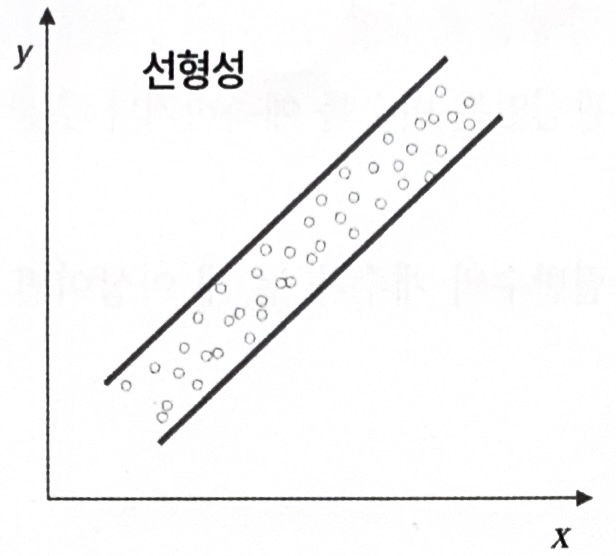
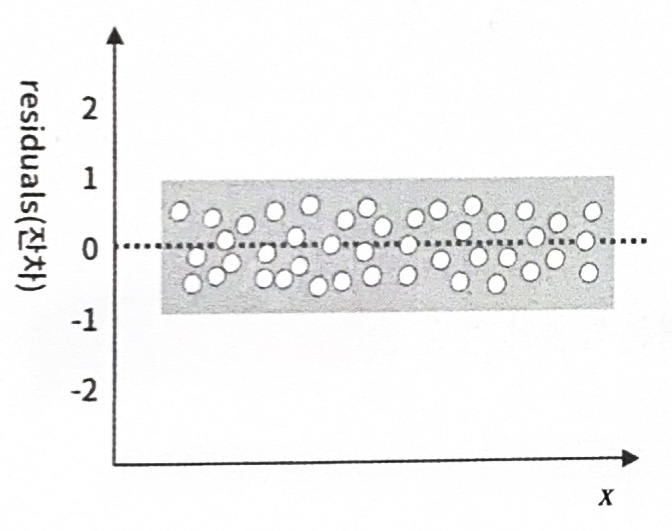
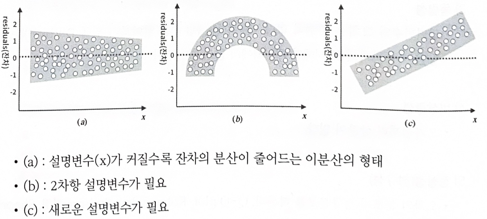
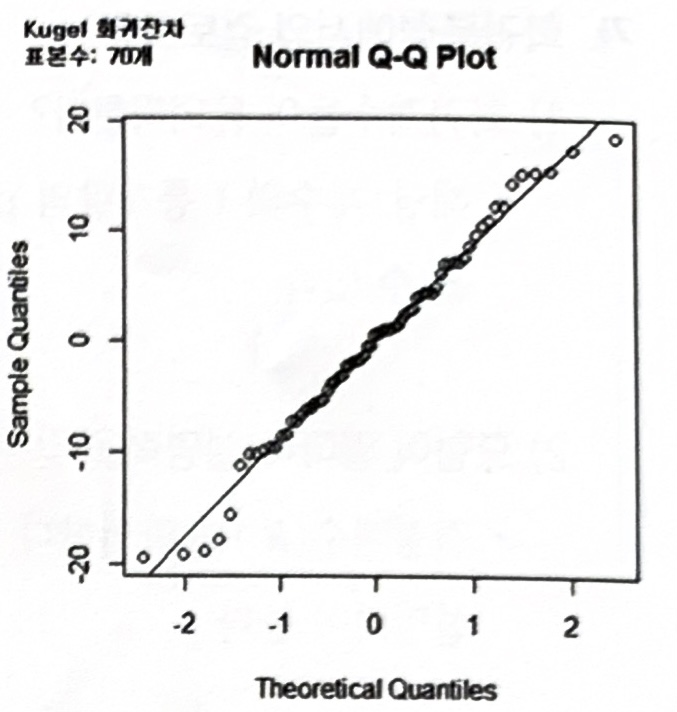
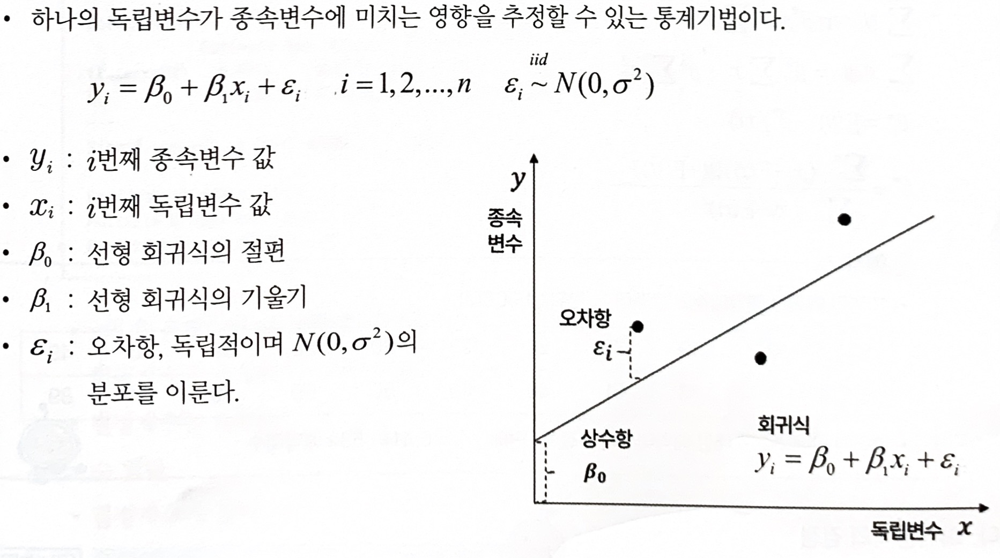

# 회귀분석

## 1. 회귀분석의 개요

### 가. 회귀분석의 정의

- 하나나 그 이상의 독립변수들이 종속변수에 미치는 영향을 추정할 수 있는 통계기법
- 변수들 사이의 인과관계를 밝히고 모형을 적합하여 관심있는 변수를 예측하거나 추론하기 위한 분석방법
- 독립변수가 하나이면 단순선형회귀분석, 독립변수가 두 개 이상이면 다중선형회귀분석으로 분석

### 나. 회귀분석의 변수

- 영향을 주는 변수(x): `설명변수`(explanatory variable), `독립변수`(independent variable), `예측변수`(predictor variable)
- 영향을 받는 변수(y): `반응변수`(response variable), `종속변수`(dependent variable), `결과변수`(outcome variable)

### 다. 선형회귀분석의 가정

**1) 선형성**

- 입력변수와 출력변수의 `관계가 선형`(선형회귀분석에서 가장 중요한 가정)

**2) 등분산성**

- `오차의 분산이 입력변수와 무관하게 일정.`
- `잔차 플롯(산점도)를 활용`하여 잔차와 입력변수간에 관련이 없도록 무작위적으로 고루 분포되어야 등분산성 가정을 만족

**3) 독립성**

- `입력변수와 오차간 관련 없다.`

**4) 비상관성**

- 오차들끼리 상관이 없다.

**5) 정규성**

- `오차의 분포가 정규분포`를 따른다.
- 히스토그램, Q-Q plot, Kolmogolov-Smirnov 검정, Shaprio-Wilk test 등을 활용하여 정규성 확인

### 라. 그래프를 활용한 선형회귀분석의 가정 검토

**1) 선형성**

- 선형회귀모형에서 설명변수(x)와 반응변수(y)가 선형적 관계에 있음이 전제

**2) 등분산성**

- 등분산성을 만족하는 경우

    

- 설명변수(x)에 대한 잔차의 산점도를 그렸을 때, 설명변수(x) 값에 관계없이 잔차들의 변동성(분산)이 일정한 형태를 보이면 선형회귀분석의 가정 중 등분산성을 만족한다고 볼 수 있다.

- 등분산성을 만족하지 못하는 경우
    
    
    

**3) 정규성**

- `Q-Q Plot`에서, 잔차가 대각방향의 직선의 형태를 지니고 있으면 잔차는 정규분포를 따른다고 할 수 있다.

     

     

> 선형회귀분석 잔차분석, 오차 정규성 검정
> 
> 정상성을 만족하지 않을 때는 log, root를 취하여 정규분포를 취하도록 만든다.

### 마. 가정에 대한 검증

**1) 단순선형회귀분석**

- 입력변수와 출력변수간의 선형성을 점검하기 위해 산점도를 확인한다.

**2) 다중선형회귀분석**

- 선형회귀분석의 가정인 선형성, 등분산성, 독립성, 정상성이 모두 만족하는지 확인해야 한다.
