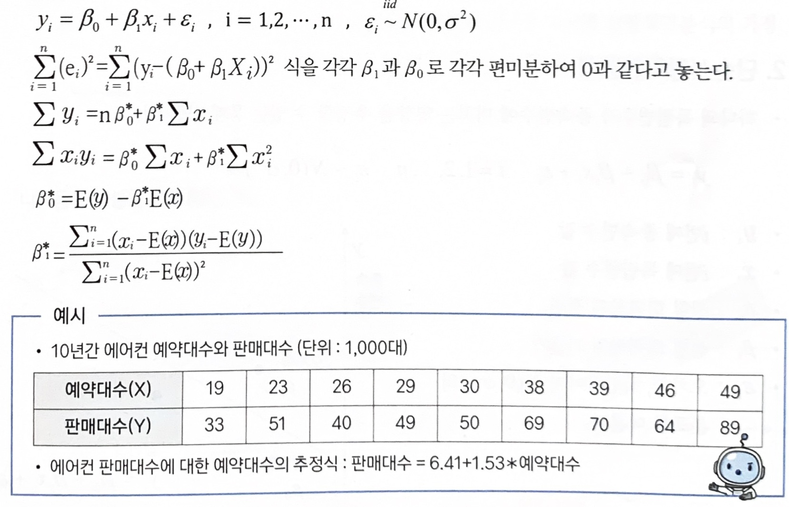
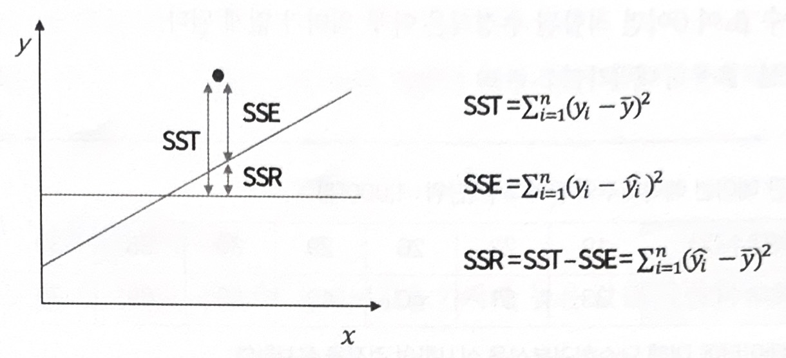

# 단순선형회귀분석

  

## 가. 회귀분석에서의 검토사항

### 1) 회귀계수들이 유의미한가?

- 해당 계수의 `t 통계량`의 `p-value`가 `0.05보다 작으면` 해당 회귀계수가 `통계적으로 유의미`하다고 볼 수 있다.  

### 2) 모형이 얼마나 설명력을 갖는가?

- `결정계수`($R^2$)를 확인
- 결정계수는 0~1 사이, `높은 값` 일수록 추정된 회귀식의 `설명력이 높다.`
     > 해당 회귀식이 데이터를 적절하게 설명하고 있다고는 할 수 있다.

- 결정계수는 총변동 중에서 회귀모형에 의하여 설명되는 변동이 차지하는 비율  

### 3) 모형이 데이터를 잘 적합하고 있는가?

- 잔차를 그래프로 그리고 회귀진단을 한다.
    

## 나. 회귀계수의 추정(최소제곱법, 최소자승법)

- `측정값을 기초로 하여 적당한 제곱합을 만들고 그것을 최소로 하는 값`을 구하여 측정결과를 처리하는 방법으로 `잔차제곱이 가장 작은 선`을 구하는 것
- 주어진 자료를 가장 잘 설명하는 회귀계수의 추정치는 보통 `제곱오차를 최소로 하는 값`을 구한다. 이와 같이 구해진 회귀계수 추정량을 최소제곱이라고 한다.
- 추정식

    

    

## 다. 회귀분석의 검정

### 1) 회귀계수의 검정

- 회귀계수 $\beta_1$이 0이면 입력변수 $x$와 출력변수 $y$ 사이에는 아무런 인과관계가 없다.
- 회귀계수 $\beta_1$이 0이면 적합된 추정식은 아무 의미가 없게 된다. (귀무가설: $\beta_1 = 0$, 대립가설: $\beta_1 \ne 0$)

### 2) 결정계수($R^2$)

- 전체제곱합(total sum of squares, **SST**): $\sum_{i=1}^n(y_i-\bar{y})^2$
- 회귀제곱합(regression sum of squares, **SSR**): $\sum_{i=1}^n(\widehat{y}_i-\bar{y})^2$
- 오차제곱합(error sum of squares, **SSE**): $\sum_{i=1}^n(y_i-\widehat{y}_i)^2$
  
 

- 결정계수($R^2$)는 전체제곱합에서 회귀제곱합의 비율(SSR/SST), 0 ≤ $R^2$ ≤ 1(여기서 SST = SSR + SSE)
- 결정계수($R^2$)는 전체 데이터를 회귀모형이 설명할 수 있는 설명력을 의미한다.(단순회귀분석에서 결정계수는 상관계수 r의 제곱과 같다.)

### 3) 회귀직선의 적합도 검토

- 결정계수($R^2$)를 통해 추정된 회귀식이 얼마나 타당한지 검토 ($R^2$가 1에 가까울수록 회귀모형이 자료를 잘 설명함)

- 독립변수가 종속변수 변동의 몇 %를 설명하는지 나타내는 지표

- `다변량 회귀분석`에서는 독립변수의 수가 많아지면 결정계수($R^2$)가 높아지므로 `독립변수가 유의하든, 유의하지 않든 독립변수의 수가 많아지면, 결졍계수는 높아지는 단점` 존재

- 이런 단점을 보완하기 위해 `수정된 결정계수`($R^2_a$: adjusted $R^2$)를 활용
  

> 오차(error)와 잔차(residual)의 차이
> 
> - 오차: 모집단에서 실제값이 회귀선과 비교해 볼 때 나타나는 차이(정확치와 관측치의 차이)
> - 잔차: 표본에서 나온 관측값이 회귀선과 비교해볼 때 나타나는 차이
>
> - 회귀모형에서 오차항은 측정할 수 없으므로 잔차를 오차항의 관찰값으로 해석하여 오차항에 대한 가정들의 성립 여부를 조사함

