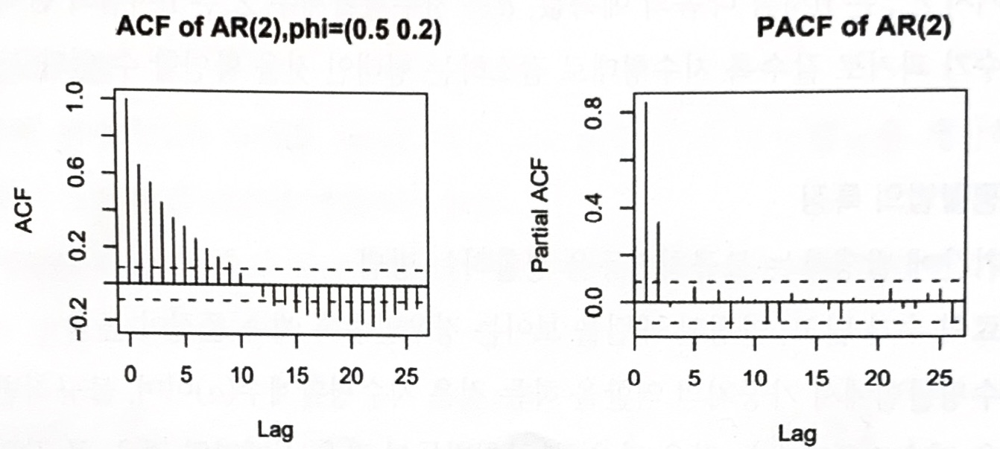
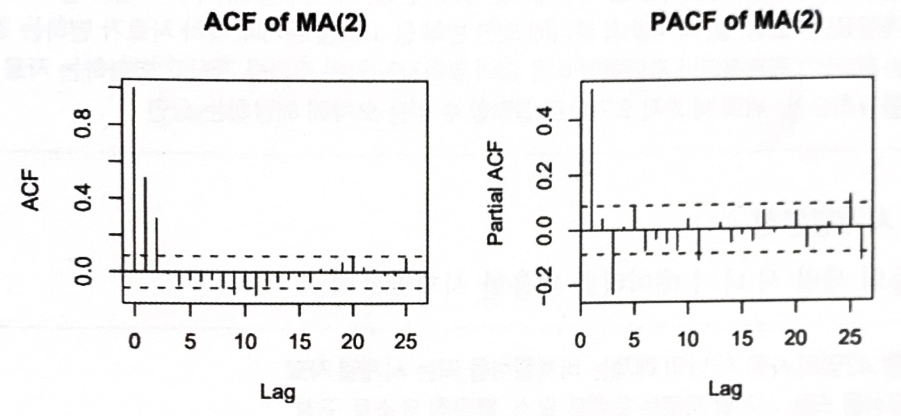

# 시계열 모형

시계열의 모형은 자기회귀 모형(AR 모형), 이동평균 모형(MA 모형), 자기회귀누적이동평균 모형(ARIMA 모형)이 있다.

 

## 가. 자기회귀 모형(AR 모형, autoregressive model)

- p 시점 전의 자료가 현재 자료에 영향을 주는 모형이다.
    
    $Z_t=\phi_1Z_{t-1}+\phi_2Z_{t-2}+\cdots+\phi_pZ_{t-p}+\alpha_t$
    
- AR(1) 모형: $Z_t=\phi_1Z_{t-1}+\alpha_t$ , 직전 시점 데이터로만 분석
- AR(2) 모형: $Z_t=\phi_1Z_{t-1}+\phi_2Z_{t-2}+\alpha_t$ , 연속된 2시점 정도의 데이터로 분석
- 자기상관함수(ACF)는 빠르게 감소, 부분자기함수(PACF)는 어느 시점에서 절단점을 가진다.
- AR(2) 모형의 자기사관함수(ACF)와 편자기상관함수(PACF)

    

  

## 나. 이동평균 모형(MA 모형, Moving Average model)

- 유한한 개수의 백색잡음의 결합이므로 언제나 정상성을 만족(잡음
- 1차 이동평균모형(MA1 모형)은 이동평균모형 중에서 가장 간단한 모형으로 시계열이 같은 시점의 백색잡음과 바로 전 시점의 백색잡음의 결합으로 이뤄진 모형
    
    $Z_t=\alpha_t-\theta_1\alpha_{t-1}-\theta_2\alpha_{t-2}-\cdots-\theta_p\alpha_{t-p}$
    
- 2차 이동평균모형(MA2 모형)은 바로 전 시점의 백색잡음과 시차가 2인 백색 잡음의 결합으로 이뤄진 모형
    
    $Z_t=\alpha_t-\theta_1\alpha_{t-1}$
    
- AR 모형과 반대로 ACF에서 절단점을 갖고, PACF가 빠르게 감소
    
    $Z_t=\alpha_t-\theta_1\alpha_{t-1}-\theta_2\alpha_{t-2}$
    
- MA(2) 모형의 자기상관함수(ACF)와 편자기상관함수(PACF)

    
    
  

## 다. 자기회귀누적이동평균 모형(ARIMA(p,d,q) 모형, autoregressive integrated moving average model)

- `ARIMA`는 비정상 시계열 모형
- ARIMA 모형을 차분이나 변환을 통해 AR모형이나 MA모형, 이 둘을 합친 ARMA 모형으로 `정상화` 할 수 있다.
    > ARMA 모형은 약한 정상성을 가진 확률적 시계열을 표현하는데 사용한다.
- $p$는 `AR 모형`, $q$는 `MA모형`과 관련이 있는 차수
  
- 시계열 {${Z_t}$}의 d번 차분한 시계열이 ARMA(p,q) 모형이면, 시계열 {${Z_t}$}는 차수가 p, d, q인 ARIMA 모형, 즉 ARIMA(p, d, q) 모형을 갖는다
  
- $d=0$ 이면 `ARMA(p, q)`, 이 모형은 정상성을 만족
  > (ARMA(0,0)일 경우 정상화가 불필요하다.)
- $p=0$이면 `IMA(d,q)`, d번 차분하면 MA(q)모형을 따른다.
- $q=0$이면 `ARI(p,d)`, d번 차분한 시계열이 AR(p) 모형을 따른다.
    

  - ARIMA(0, 1, 1)의 경우에는 1 차분 후 MA(1) 활용
  
  - ARIMA(1, 1, 0)의 경우에는 1 차분 후 AR(1) 활용
  
  - ARIMA(1, 1, 2)의 경우에는 1 차분 후 AR(1), MA(2), ARMA(1, 2) 선택 활용
  - 이런 경우  가장 간단한 모형을 선택하거나 AIC를 적용하여 점수가 가장 낮은 모형을 선정한다.
    
  

## 라. 분해 시계열

- 시계열에 영향을 주는 일반적인 요인을 시계열에서 분리해 분석하는 방법을 말하며 회귀분석적인 방법을 주로 사용한다.

- 분해식의 일반적 정의
    
    $Z_t=f(T_t,S_t,C_t,I_t)$
    
### 분해 요소
    
- $T_t:$ 경향(추세)요인, 자료가 오르거나 내리는 추세, 선형, 이차식 형태, 지수적 형태 등(`장기적으로 변해가는 큰 흐름`을 나타내는 것)
- $S_t:$  계절요인(변동), 요일, 월, 사계절 각 분기에 의한 변화 등 고정된(일정한) 주기에 따라 `(반복적으로)`자료가 변하는 경우(같은 패턴을 보이는 변동)
- $C_t:$ 순환요인(변동), 경제적이나 자연적인 `이유 없이 알려지지 않은 주기`를 가지고 변화하는 자료
- $I_t:$ 불규칙요인(변동), `위의 세 가지 요인으로 설명할 수 없는` 오차에 해당하는 요인
