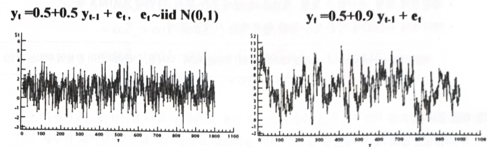

# 시계열 분석 및 정상성

## Summary
- 시계열 자료 구분:
    
    시간의 흐름에 따라 관찰된 데이터를 시계열 데이터 또는 시계열 자료라고 한다. 시계열 자료에는 주식가격 데이터, 실업률, 기후데이터 등
    
- 시계열 자료의 정상성 구분:
    
    대부분의 시계열 자료는 비정상성 데이터. 시계열 자료를 통해 미래를 예측하기 위해서는 비정상성 데이터를 정상성 데이터로 변화하여 분석모형을 설계할 수 있다.
    
- 시계열 분석:
    
    시계열 분석은 시계열 자료를 통해 미래를 예측하거나 시계열 데이터의 특성을 파악하는 것을 의미. 시계열 분석은 자기회귀모형과 이동평균모형으로 구분.

  

## 1. 시계열 자료

### 가. 개요

- 시간의 흐름에 따라 관찰된 값
- 시계열 데이터의 분석을 통해 미래의 값을 예측하고 경향, 주기, 계절성 등을 파악
- 다른 분석모형과 마찬가지로 탐색 목적과 예측 목적으로 나눌 수 있다?
- 시계열 분석의 주목적은 외부인자와 관련해 계절적인 패턴, 추세와 같은 요소를 설명할 수 있는 자료

 

### 나. 시계열 자료의 종류

#### 1) **비정상성** 시계열 자료

- 시계열 분석을 실시할 때 다루기 어려운 자료로 대부분의 시계열자료가 이에 해당

#### 2) **정상성** 시계열 자료

- 비정상 시계열을 핸들링해 다루기 쉬운 시계열 자료로 변환한 자료

 

> 시계열이 정상 시계열인지 비저상 시계열인지 판단하기 위해 폭발적인 추세를 보이거나 시간에 따라 분산이 변화하는지 관찰해야 함

  

## 2. 정상성

- 정상성은 `평균이 일정`할 때, `분산이 일정`할 때, `공분산도 단지 시차에만 의존`하고 실제 `특정 시점 t, s에는 의존하지 않을 때` 만족한다.

- 정상성(Stationary)을 만족한다는 것은 `‘분산’이 시점에 ‘의존하지 않는다’는 것`
    
 

### 가. 평균이 일정할 경우

- 모든 시점에 대해 일정한 평균을 가진다.
  
- 평균이 일정하지 않은(=자료가 추세를 보이는 경우) 비정상시계열은 `차분(difference)`을 통해 정상화

- `차분` : 현시점 자료에서 전 시점 자료를 뺴는 것
    - 일반차분(regular difference): 바로 `전 시점`의 자료를 빼는 방법
    - 계절차분(seasonal difference): `여러 시점` 전의 자료를 빼는 방법, 주로 계절성을 갖는 자료를 정상화 하는데 사용한다.

 

### 나. 분산이 일정

- 분산도 시점에 의존하지 않고 일정해야 한다.

- 분산이 일정하지 않을 경우 변환(Transformation)을 통해 정상화

 

### 다. 공분산도 단지 시차에만 의존

- 실제 특정 시점 t, s에는 의존하지 않는다.

 

### 라. 정상 시계열의 모습

- 일정한 평균 : $E(y_t)=\mu$  

- 일정한 분산 : $var(y_t)=\sigma^2$

- 공분산은 t가 아닌 s에 의존함 : $cov(y_t,y_{t+s})=cov(y_t,y_{t-s})=\gamma_s$

 

### 마. 정상 시계열의 특징

- 정상 시계열은 어떤 시점에서 평균과 분산 그리고 특정한 시차의 길이를 갖는 자기공분산을 측정하더라도 동일한 값을 갖는다.
- 정상 시계열은 항상 그 평균값으로 회귀하려는 경향이 있으며, 그 평균값 주변에서의 변동은 대체로 일정한 폭을 갖는다.
- 정상 시계열이 아닌 경우 특정 기간의 시계열 자료로부터 얻은 정보를 다른 시기로 일반화할 수 없다.
